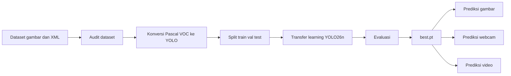

# MaskGuard — Face Mask Detection with YOLO26n

MaskGuard adalah proyek Computer Vision untuk mendeteksi status penggunaan masker pada wajah menggunakan **Ultralytics YOLO26n**.

## Permasalahan

Pemeriksaan penggunaan masker secara manual pada area padat membutuhkan waktu, petugas, dan konsistensi tinggi. MaskGuard mengotomatisasi proses tersebut melalui object detection pada gambar, foto webcam, dan video.

## Kelas Deteksi

| ID | Kelas | Makna |
|---:|---|---|
| 0 | `with_mask` | Masker digunakan dengan benar |
| 1 | `without_mask` | Tidak menggunakan masker |
| 2 | `mask_weared_incorrect` | Masker digunakan tidak tepat |

## Fungsi dan Fitur

- Mengunduh dataset publik melalui KaggleHub.
- Mengaudit jumlah gambar, anotasi, dan distribusi kelas.
- Mengonversi anotasi Pascal VOC XML menjadi format YOLO.
- Membagi dataset menjadi train, validation, dan test.
- Melatih model `yolo26n.pt` dengan transfer learning.
- Menghitung precision, recall, mAP50, dan mAP50–95.
- Menampilkan confusion matrix, PR curve, dan F1 curve.
- Mendeteksi masker dari gambar, webcam Colab, dan video.
- Mengekspor model ke ONNX.
- Menyimpan `best.pt` dan hasil deteksi untuk dokumentasi.

## Struktur Proyek

```text
MaskGuard_YOLO26n/
├── MaskGuard_YOLO26n.ipynb
├── README.md
├── requirements.txt
├── data.yaml.example
├── .gitignore
├── src/
│   ├── predict_image.py
│   └── predict_webcam.py
├── docs/
│   └── HASIL.md
├── models/
│   └── .gitkeep
└── samples/
    └── .gitkeep
```

## Instalasi

### Opsi 1 — Google Colab

1. Unggah `MaskGuard_YOLO26n.ipynb` ke Google Colab.
2. Pilih `Runtime → Change runtime type → T4 GPU`.
3. Jalankan seluruh sel secara berurutan.

### Opsi 2 — Lokal

```bash
git clone https://github.com/USERNAME/MaskGuard-YOLO26n.git
cd MaskGuard-YOLO26n

python -m venv .venv

# Windows
.venv\Scripts\activate

# Linux/macOS
source .venv/bin/activate

pip install -r requirements.txt
```

## Cara Kerja



1. Dataset diunduh melalui KaggleHub.
2. Anotasi XML dibaca dan dikonversi ke koordinat YOLO ter-normalisasi.
3. Data dibagi menjadi 70% train, 20% validation, dan 10% test.
4. Model YOLO26n pretrained di-fine-tune pada tiga kelas masker.
5. Model terbaik dipilih dari `best.pt`.
6. Model dievaluasi pada test set.
7. Inference menghasilkan bounding box, label kelas, dan confidence.

## Menjalankan Prediksi Gambar

Letakkan bobot hasil training di `models/best.pt`.

```bash
python src/predict_image.py \
  --weights models/best.pt \
  --source samples/contoh.jpg \
  --output outputs
```

Windows PowerShell:

```powershell
python src/predict_image.py --weights models/best.pt --source samples/contoh.jpg --output outputs
```

## Menjalankan Webcam Lokal

```bash
python src/predict_webcam.py --weights models/best.pt --camera 0
```

Tekan `q` untuk menutup jendela webcam.

## Tampilan Hasil


Notebook otomatis membuat:

```text
/content/maskguard_yolo26n/
├── docs/hasil_deteksi.jpg
└── runs/
    ├── maskguard_yolo26n/
    │   ├── results.png
    │   └── weights/
    │       ├── best.pt
    │       └── last.pt
    ├── maskguard_yolo26n_test/
    │   ├── confusion_matrix_normalized.png
    │   ├── PR_curve.png
    │   └── F1_curve.png
    └── maskguard_predict/
        └── hasil_prediksi.jpg
```

Setelah notebook selesai dijalankan, salin `docs/hasil_deteksi.jpg` ke folder `docs/` repositori. Gambar dapat ditampilkan pada README dengan:

```markdown

```

## Batasan

- Performa dipengaruhi pencahayaan, sudut wajah, resolusi, dan occlusion.
- Dataset mungkin tidak merepresentasikan seluruh variasi pengguna dan lingkungan.
- Sistem ini bukan alat medis.
- Sistem tidak melakukan face recognition dan tidak boleh digunakan untuk mengidentifikasi individu.
- Gunakan kamera secara transparan dan patuhi aturan privasi yang berlaku.

## Referensi

- Ultralytics YOLO26 Documentation: https://docs.ultralytics.com/models/yolo26/
- Ultralytics Train Mode: https://docs.ultralytics.com/modes/train/
- Ultralytics Predict Mode: https://docs.ultralytics.com/modes/predict/
- Face Mask Detection Dataset: https://www.kaggle.com/datasets/andrewmvd/face-mask-detection
